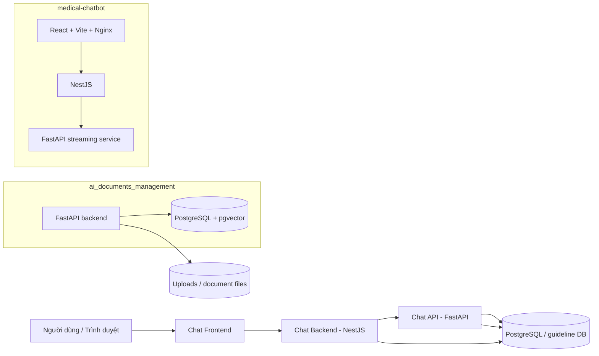

# Chatbot Local Workspace - README Chi Tiết

Tài liệu này là bản README mở rộng cho toàn bộ workspace `chatbot_local`, dùng để mô tả đầy đủ hơn về cấu trúc dự án, các thành phần, cách chạy local, cấu hình, luồng hoạt động và các lưu ý vận hành.

## 1. Tổng Quan

`chatbot_local` là một workspace gồm 2 hệ thống chính:

- `ai_documents_management`: backend quản lý guideline/tài liệu y tế, PostgreSQL/pgvector và xử lý ingestion/chunk/search.
- `medical-chatbot`: hệ thống chatbot y tế gồm frontend, NestJS backend và FastAPI chat-api.

Mục tiêu của workspace là ghép 2 mảng lại thành một stack hoàn chỉnh:

- quản lý tài liệu và guideline
- ingest file tài liệu
- chia đoạn/chunk để tìm kiếm
- phục vụ API nội bộ cho chatbot
- cung cấp giao diện người dùng qua trình duyệt

## 2. Kiến Trúc Tổng Thể



### Ý nghĩa từng khối

- `ai_documents_management` chịu trách nhiệm phần dữ liệu tài liệu, guideline, section, chunk, user, auth và các job liên quan đến ingestion.
- `medical-chatbot` là lớp ứng dụng người dùng cuối, gồm giao diện web, backend nghiệp vụ và service chat chuyên dụng.
- Cả hai hệ thống đều dùng PostgreSQL ở local, nhưng cách chạy và service đích khác nhau.

## 3. Cấu Trúc Repository

```text
chatbot_local/
├── chatbot_local.code-workspace
├── README.md
├── README_DETAILED.md
├── ai_documents_management/
│   ├── app/
│   │   ├── api/
│   │   ├── core/
│   │   ├── models/
│   │   ├── schemas/
│   │   └── services/
│   ├── docker/
│   ├── docker-compose.yml
│   ├── Dockerfile
│   ├── README.md
│   ├── requirements.txt
│   └── uploads/
└── medical-chatbot/
    ├── LOCAL_RUNBOOK.md
    ├── chat-api/
    ├── chat-backend/
    ├── chat-frontend/
    ├── deploy/
    │   ├── docker-compose.yml
    │   ├── .env.example
    │   ├── backend.config.example.yml
    │   └── backend.config.yml
    └── README.md
```

## 4. Các Thành Phần Chính

### 4.1 `ai_documents_management`

Đây là backend FastAPI cho nền tảng quản lý guideline và tài liệu.

Các nhóm chức năng chính:

- xác thực và phân quyền người dùng
- quản lý guideline, version, document, section, chunk
- ingestion tài liệu từ file
- tạo chunk để tìm kiếm/ngữ nghĩa hóa
- lưu vector embedding vào PostgreSQL/pgvector
- hỗ trợ các service xử lý nghiệp vụ theo từng tầng

### 4.2 `medical-chatbot`

Đây là hệ thống chatbot nhiều dịch vụ.

Các phần chính:

- `chat-frontend`: giao diện người dùng React + Vite, được phục vụ qua Nginx khi chạy Docker.
- `chat-backend`: API chính bằng NestJS, xử lý logic ứng dụng và trung gian với chat-api.
- `chat-api`: FastAPI service chuyên cho chat streaming, tích hợp OpenAI và truy vấn dữ liệu.
- `deploy`: nơi chứa compose file, biến môi trường mẫu và cấu hình triển khai.

## 5. Tech Stack

### 5.1 `ai_documents_management`

| Tầng | Công nghệ |
|---|---|
| Framework | FastAPI 0.115 |
| ORM | SQLAlchemy 2.0 async |
| Driver DB | asyncpg, psycopg2-binary |
| Vector DB | pgvector |
| Migration | Alembic |
| Validation | Pydantic v2 |
| Auth | JWT Bearer + RBAC |
| Server | Uvicorn |
| AI / Parsing | OpenAI, LandingAI ADE, PyMuPDF, pypdf |

### 5.2 `medical-chatbot`

| Thành phần | Công nghệ |
|---|---|
| Frontend | React 19, Vite, TypeScript, Nginx |
| Backend | NestJS |
| Chat service | FastAPI, Python 3.11 |
| Hạ tầng | Docker, Docker Compose |
| Database | PostgreSQL |
| Cache / queue | Redis |

## 6. Luồng Hoạt Động

### 6.1 Luồng tài liệu / guideline

1. Người dùng hoặc hệ thống nạp tài liệu vào backend của `ai_documents_management`.
2. Backend lưu metadata, file gốc và các bản version.
3. Tài liệu được tách thành section/chunk.
4. Chunk được tạo embedding và lưu vào PostgreSQL/pgvector.
5. Các service truy vấn có thể dùng dữ liệu này để tìm kiếm hoặc phục vụ chatbot.

### 6.2 Luồng chatbot

1. Người dùng mở frontend ở trình duyệt.
2. Frontend gọi `chat-backend`.
3. `chat-backend` điều phối logic ứng dụng, auth, dữ liệu và request đến `chat-api`.
4. `chat-api` xử lý streaming, gọi OpenAI và/hoặc truy vấn database.
5. Kết quả trả về frontend để hiển thị cho người dùng.

## 7. Yêu Cầu Trước Khi Chạy

- Windows, macOS hoặc Linux.
- Docker Desktop đang chạy.
- Docker Compose v2.
- Git.
- OpenAI API key nếu muốn test các luồng liên quan đến AI.
- VS Code nếu muốn mở workspace đầy đủ.

## 8. Mở Workspace Trong VS Code

Nên mở file workspace ở root repo:

```text
chatbot_local.code-workspace
```

Hoặc trong VS Code:

- `File > Open Workspace from File...`
- chọn `chatbot_local.code-workspace`

Khi mở đúng workspace, bạn sẽ thấy hai folder chính:

- `ai_documents_management`
- `medical-chatbot`

## 9. Thiết Lập Và Chạy Local

Tài liệu này tóm tắt theo hướng dễ đọc. Nếu cần hướng dẫn chi tiết từng bước hơn cho `medical-chatbot`, xem thêm [medical-chatbot/LOCAL_RUNBOOK.md](medical-chatbot/LOCAL_RUNBOOK.md).

### 9.1 Chạy `ai_documents_management`

```bash
cd ai_documents_management
cp .env.example .env
docker compose up -d db
```

Database mặc định chạy local qua port `5436`.

Thông tin kết nối thường dùng:

- Host: `localhost`
- Port: `5436`
- Database: `guideline_management`
- User: `postgres`
- Password: `postgres`

Sau khi DB sẵn sàng, backend có thể được chạy riêng hoặc qua Docker theo cấu hình của project.

### 9.2 Chạy `medical-chatbot`

```bash
cd medical-chatbot
cp deploy/.env.example deploy/.env
cd deploy
docker compose up -d --build
```

Nếu đã build xong trước đó và chỉ muốn khởi động lại nhanh:

```bash
docker compose up -d --no-build chat-api chat-backend chat-frontend
```

## 10. Cấu Hình Môi Trường

### 10.1 `ai_documents_management`

Một số biến môi trường quan trọng thường gặp:

```env
DB_HOST=...
DB_PORT=5432
DB_NAME=...
DB_USER=...
DB_PASSWORD=...
APP_ENV=development
DEBUG=true
AUTO_CREATE_TABLES=true
SEED_AUTH_DATA=true
JWT_SECRET_KEY=change-this-secret
LOCAL_STORAGE_ROOT=uploads
SCORE_THRESHOLD=0.65
CHUNK_MAX_CHARS=3000
OPENAI_API_KEY=
OPENAI_API_URL=https://api.openai.com/v1
OPENAI_MODEL_NAME=gpt-4.1
OPENAI_EMBEDDING_MODEL_NAME=text-embedding-3-large
LANDINGAI_API_KEY=
LANDINGAI_API_URL=https://api.va.landing.ai/v1/ade/parse
LANDINGAI_MODEL_NAME=dpt-2-latest
```

Ý nghĩa nhanh:

- `AUTO_CREATE_TABLES=true`: tự tạo bảng khi chạy local.
- `SEED_AUTH_DATA=true`: seed dữ liệu auth mặc định.
- `LOCAL_STORAGE_ROOT=uploads`: nơi lưu file upload cục bộ.
- `CHUNK_MAX_CHARS`: giới hạn độ dài chunk.
- `SCORE_THRESHOLD`: ngưỡng điểm cho truy vấn/tìm kiếm ngữ nghĩa.

### 10.2 `medical-chatbot/deploy/.env`

Các biến chính trong deploy layer:

```env
FRONTEND_PORT=8400
VITE_BACKEND_URL=http://chat-backend:3000
VITE_DOCUMENT_FILE_URL_TEMPLATE=http://localhost:8000/api/v1/documents/{documentId}/file
VITE_MAINTENANCE_MESSAGE=
DB_HOST=host.docker.internal
DB_PORT=5436
DB_NAME=guideline_management
DB_USER=postgres
DB_PASS=postgres
DB_SYNCHRONIZE=true
JWT_SECRET=change_me_for_local_development
OPENAI_API_KEY=sk-xxx
LLM_MODEL=gpt-4.1
EMBEDDING_MODEL=text-embedding-3-large
```

Ghi chú quan trọng:

- `host.docker.internal` cho phép container gọi về DB đang chạy trên máy host.
- `FRONTEND_PORT=8400` là port truy cập UI trên trình duyệt.
- `DB_SYNCHRONIZE=true` phù hợp local, không nên giữ nguyên cho production nếu muốn kiểm soát schema chặt hơn.
- `VITE_BACKEND_URL` cần là URL nội bộ Docker DNS khi frontend chạy trong container.

## 11. Port Mặc Định

| Thành phần | Port |
|---|---|
| `ai_documents_management` DB | `5436` |
| `ai_documents_management` backend | `8000` |
| `medical-chatbot` frontend | `8400` |
| `medical-chatbot` chat-api | `8000` nội bộ container |
| `medical-chatbot` chat-backend | `3000` nội bộ container |

Lưu ý: trong Docker network, các service gọi nhau bằng hostname service, không phải localhost.

## 12. Docker Compose Và Service Name

### 12.1 `ai_documents_management`

Service chính trong compose:

- `db`: PostgreSQL + pgvector
- `backend`: FastAPI backend

### 12.2 `medical-chatbot`

Service trong compose:

- `chat-frontend`
- `chat-backend`
- `chat-api`
- `postgres` và `redis` có trong file compose nhưng đang để profile `disabled`

Ngoài ra còn có network external:

- `chatbot-db`

Nếu network này chưa tồn tại, tạo một lần bằng:

```bash
docker network create chatbot-db
```

## 13. Các Lệnh Hữu Ích

### Xem container đang chạy

```bash
docker ps --format "table {{.Names}}\t{{.Status}}\t{{.Ports}}"
```

### Xem log `ai_documents_management`

```bash
cd ai_documents_management
docker compose logs -f db
docker compose logs -f backend
```

### Xem log `medical-chatbot`

```bash
cd medical-chatbot/deploy
docker compose logs -f chat-frontend
docker compose logs -f chat-backend
docker compose logs -f chat-api
```

### Dừng dịch vụ

```bash
cd medical-chatbot/deploy
docker compose down
```

Hoặc với DB backend:

```bash
cd ai_documents_management
docker compose down
```

## 14. Kiểm Tra Nhanh Sau Khi Chạy

### 14.1 Kiểm tra frontend

Mở trình duyệt:

```text
http://localhost:8400
```

### 14.2 Kiểm tra health của backend công khai

```bash
curl http://localhost:8400/health
```

Kết quả mong đợi là trạng thái `healthy`.

### 14.3 Kiểm tra database guideline

Nếu chạy `ai_documents_management`, có thể kiểm tra thêm health endpoint của backend hoặc xem log container DB.

## 15. Tài Liệu API Và Chức Năng

### `ai_documents_management`

Project này tập trung vào các nhóm API và service như:

- auth và quản lý role
- guideline
- guideline version
- document
- section
- chunk
- ingestion job
- workspace / metadata / file handling

### `medical-chatbot`

Project này gồm các tầng:

- frontend hiển thị chat UI
- backend NestJS làm lớp điều phối
- chat-api FastAPI phục vụ luồng AI và streaming

## 16. Lưu Ý Khi Làm Việc Với Codebase Này

- Đây là workspace 2 project, không nên coi nó là một app đơn lẻ.
- `ai_documents_management` và `medical-chatbot` có lifecycle riêng.
- File `.env` và config thật không nên commit.
- Khi chạy local trên Windows, Docker Desktop và `host.docker.internal` rất quan trọng cho kết nối giữa container và DB host.
- Nếu đổi port DB hoặc frontend, cần đồng bộ lại cả file `.env` lẫn compose.

## 17. Troubleshooting

### Không truy cập được frontend ở `localhost:8400`

Kiểm tra:

- container `chat-frontend` đã chạy chưa
- port `FRONTEND_PORT` có bị chiếm không
- `docker compose ps` có báo healthy không

### Backend không kết nối được database

Kiểm tra:

- DB host đúng chưa
- nếu backend chạy trong Docker, `DB_HOST` có phải `host.docker.internal` hoặc service name nội bộ không
- database `guideline_management` đã được tạo chưa
- container DB có đang healthy không

### Lỗi do chưa có external network `chatbot-db`

Tạo network một lần:

```bash
docker network create chatbot-db
```

### Build lâu hoặc fail ở `chat-api`

Nguyên nhân thường gặp:

- Python dependencies nặng
- network chậm khi cài package
- OpenAI key hoặc biến môi trường chưa đúng

### DB port local bị trùng

Nếu máy đã dùng `5436`, hãy đổi `DB_PORT` trong compose hoặc `.env` rồi đồng bộ lại toàn bộ cấu hình liên quan.

## 18. Gợi Ý Cách Đọc Source Code

Nếu muốn hiểu dự án nhanh hơn, nên đọc theo thứ tự sau:

1. `README.md` ở root
2. `medical-chatbot/LOCAL_RUNBOOK.md`
3. `ai_documents_management/README.md`
4. `medical-chatbot/README.md`
5. `ai_documents_management/app/main.py`
6. `medical-chatbot/deploy/docker-compose.yml`

## 19. Tóm Tắt Ngắn

Nếu bạn chỉ muốn nhớ nhanh 3 điều:

- `ai_documents_management` lo phần dữ liệu guideline/document.
- `medical-chatbot` lo phần UI + backend + chat service.
- Local thường truy cập frontend ở `http://localhost:8400`.

---

Nếu cần, có thể tiếp tục mở rộng tài liệu này thành:

- bản README song ngữ Việt - Anh
- sơ đồ kiến trúc chi tiết hơn cho từng service
- tài liệu API theo từng nhóm endpoint
- runbook triển khai production
